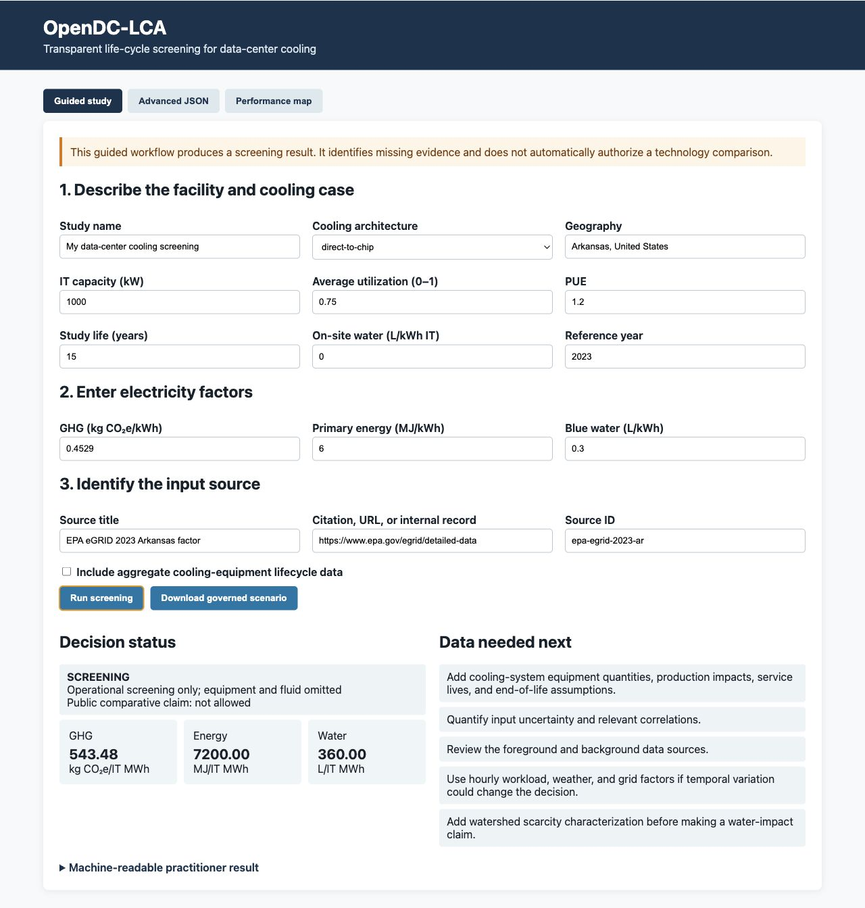
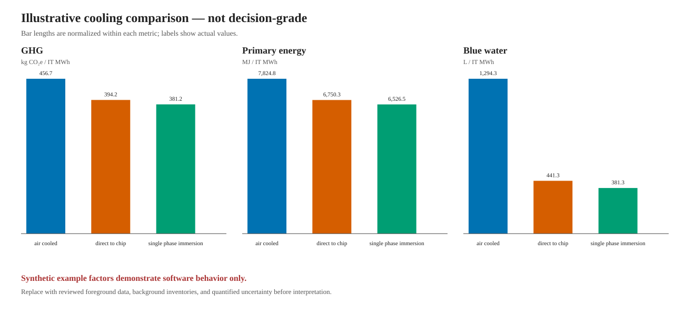
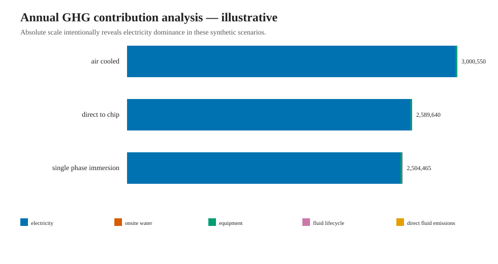
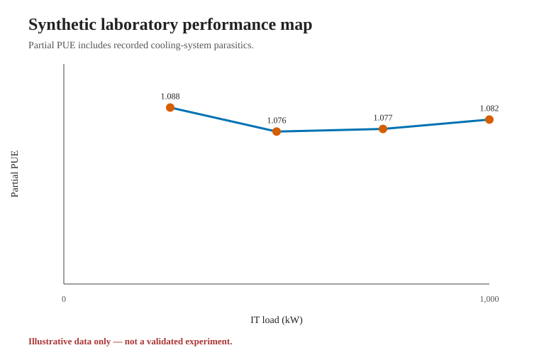
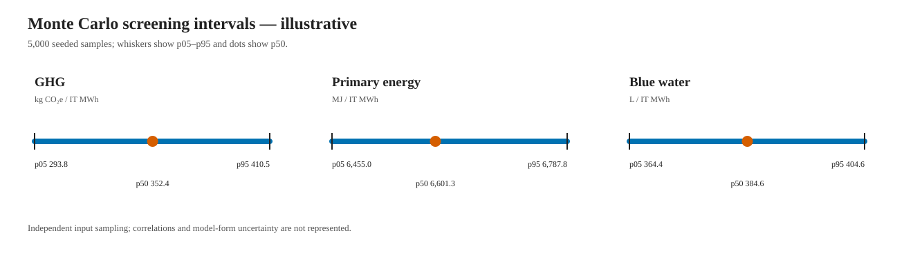
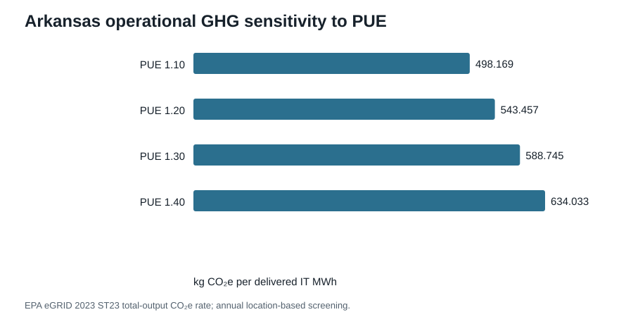

# OpenDC-LCA

[](https://github.com/UARK-NED3/OpenDC-LCA/actions/workflows/ci.yml)
[](https://github.com/UARK-NED3/OpenDC-LCA/releases/latest)
[](LICENSE)

Open, physics-informed life-cycle analysis for data-center cooling.

OpenDC-LCA helps data-center practitioners screen the annual greenhouse-gas,
primary-energy, and blue-water implications of air, direct-to-chip, immersion,
or user-defined cooling systems. It combines a guided local interface with
traceable inputs, contribution analysis, scientific audit warnings, and
machine-readable results.

> [!IMPORTANT]
> OpenDC-LCA produces screening results unless the foreground data, background
> inventories, uncertainty, system boundaries, and critical review support a
> stronger claim. Passing the automated audit is not an ISO conformity
> assessment.

## Start here

Requires Python 3.10 or newer. Install the current release:

```bash
python -m pip install \
  https://github.com/UARK-NED3/OpenDC-LCA/archive/refs/tags/v1.1.0.zip
```

Launch the guided local interface:

```bash
opendc-lca gui
```

The browser opens `http://127.0.0.1:8765/`. Enter the site, cooling, PUE,
electricity, water, equipment, and source information; then select
**Run screening**.



The interface reports annual and per-IT-MWh impacts, evidence status, missing
data, and whether a public comparison is blocked. It can also export the full
governed scenario for reproducibility.

- [Five-minute practitioner guide](docs/PRACTITIONER_GUIDE.md)
- [Complete input and output reference](docs/INPUT_OUTPUT_REFERENCE.md)
- [Example scenarios](examples/)
- [Report an issue or request help](https://github.com/UARK-NED3/OpenDC-LCA/issues)

## Related interactive tool

- [Data-Center Water and Grid Exposure Atlas](https://hanhuark.github.io/Data-Center-Water-Research/atlas/) — a public screening map for location-specific water and grid exposure.

Research outputs include the
[manuscript](paper/MANUSCRIPT.md), an
[integrated evidence workbook](paper/OpenDC-LCA_integrated_evidence.xlsx), the
[literature matrix](paper/LITERATURE_REVIEW_MATRIX.md), and a prioritized
[reference-acquisition list](docs/REFERENCE_ACQUISITION.md).

## Why this project exists

Cooling comparisons are often reduced to PUE. That misses equipment production,
coolant manufacture and loss, water consumption, hardware replacement, and the
effect of location and utilization. OpenDC-LCA makes those assumptions explicit
and machine-readable.

The long-term goal is an open benchmark and model interface that can combine:

- laboratory measurements and uncertainty;
- CFD and reduced-order performance maps;
- hourly weather, grid, workload, and water-stress data;
- equipment bills of materials and EPDs;
- reliability, replacement, heat reuse, and end-of-life scenarios; and
- optional adapters for licensed LCA databases without redistributing them.

## File-based workflow

Users who prefer files or automation can generate a compact input and a
plain-language report:

```bash
opendc-lca new-study my-input.json
# Edit my-input.json with site, cooling, grid, water, and source information.
opendc-lca prepare-study my-input.json my-scenario.json
opendc-lca practitioner-report my-scenario.json --output-dir my-results
opendc-lca capabilities
```

The results directory contains `PRACTITIONER_REPORT.md` for people and
`practitioner-results.json` for software.

<details>
<summary>Advanced CLI, uncertainty, reliability, and LCA interoperability</summary>

```bash
opendc-lca examples --output-dir examples
opendc-lca validate examples/air-cooled.json
opendc-lca run examples/air-cooled.json
opendc-lca compare examples/air-cooled.json \
  examples/direct-to-chip.json examples/single-phase-immersion.json
opendc-lca sensitivity examples/single-phase-immersion.json
opendc-lca audit examples/single-phase-immersion.json
opendc-lca report examples/air-cooled.json \
  examples/direct-to-chip.json examples/single-phase-immersion.json \
  --output-dir results/my-screening
opendc-lca performance examples/performance-map-direct-to-chip.csv
opendc-lca monte-carlo examples/direct-to-chip.json \
  examples/uncertainty-direct-to-chip.json
opendc-lca experimental-report examples/direct-to-chip.json \
  examples/performance-map-direct-to-chip.csv \
  examples/uncertainty-direct-to-chip.json \
  --output-dir results/my-experiment
opendc-lca run examples/reliability-direct-to-chip.json --json
opendc-lca openlca-export examples/direct-to-chip.json foreground.zip
opendc-lca openlca-inspect foreground.zip
opendc-lca brightway-export foreground.zip brightway.json \
  --database opendc-foreground
python -m unittest discover -s tests -v
```

</details>

The advanced GUI also accepts full scenario JSON and performance-map CSV files.
It binds to localhost by default and should not be exposed publicly.

Outputs are annual totals and values normalized per delivered IT MWh. JSON output
is available with `--json`. Installed wheels include the examples; copy them to
a working directory with:

```bash
opendc-lca examples --output-dir examples
```

## Representative output

The repository includes a reproducible
[screening report](results/representative-screening/REPORT.md), its
[machine-readable results](results/representative-screening/results.json), and
two dependency-free SVG figures:





These results use synthetic factors to demonstrate the workflow. The displayed
ranking is not evidence that one cooling architecture is environmentally
preferable.

The [v0.3 experimental report](results/v0.3-experimental/REPORT.md) demonstrates
the measurement-to-LCA path:





The [public-data report](results/public-data-v0.3/REPORT.md) provides a
reproducible Arkansas operational-GHG/PUE sensitivity, Fayetteville climate
summary, and selected construction-material factors:



Its raw third-party inputs are not redistributed. See the
[data-source registry](data/SOURCES.md) and regenerate the committed derived
records with `python scripts/refresh_public_data.py`.

## Boundary-aware paper analysis

The [paper results package](paper/RESULTS_PACKAGE.md) consolidates equations,
machine-readable tables, editable figures, and review artifacts. The analysis
reconstructs all 24 released Microsoft/Nature totals, harmonizes nine eGRID
releases to one AR5 GWP100 basis, counts transformations outside the released
electricity anchors, and tests electricity-boundary, functional-unit, and joint
assumption sensitivity. It separates robust national decarbonization from
conditional cooling rankings.

The paper workflow also decomposes rank sensitivity by grid, use phase,
embodied inventory, and service equivalence, and tests how declared dependence
among technology-specific errors changes the result. Rebuilds require the
locally held provider files listed by checksum in
`data/derived/source-file-manifest.json`; clone-only package tests do not
fabricate replacements for those files.

```bash
python scripts/run_research_analysis.py
python scripts/run_v06_measurement_demo.py
python scripts/run_integrated_evidence_analysis.py
python scripts/run_applied_energy_analysis.py
python scripts/build_source_manifest.py --check
python -m unittest discover -s tests -v
```

The TMY and synthetic performance-map demonstrations exercise the
measurement-to-LCA path but remain illustrative. The engine refuses
extrapolation beyond the measured grid and does not authorize comparative
claims until the required performance datasets and review status are present.

## Model boundary

The Phase 1 model includes:

- IT and facility electricity derived from IT capacity, capacity factor, and PUE;
- electricity-related GHG, primary-energy, and blue-water impacts;
- on-site cooling water;
- annualized, discrete, or reliability-driven equipment replacement;
- Weibull/Arrhenius failure, maintenance, downtime, and unserved-service
  exposure indicators;
- coolant manufacture, replenishment, and direct emissions from loss; and
- an auditable contribution breakdown.
- required provenance and explicit study-boundary declarations;
- scenario SHA-256 digests and model version in JSON results; and
- one-at-a-time GHG sensitivity screening.
- automated scientific-quality findings and comparative-claim blockers.
- duration-weighted laboratory performance maps that derive cooling-only
  partial PUE, on-site water intensity, and cooling COP; and
- reproducible independent-parameter Monte Carlo propagation with p05, p50,
  p95, and mean results.

The hourly performance-map path uses IT load and dry-bulb temperature with one
constant grid factor; wet-bulb temperature is validated but not yet an
interpolation coordinate. It does not yet model correlated or model-form
uncertainty, water scarcity, heat reuse, redundancy networks, repair queues,
or workload output. These are
tracked in the [research roadmap](docs/ROADMAP.md).

## Repository map

- `src/opendc_lca/`: model, validation, and command-line interface
- `schemas/`: canonical scenario JSON Schema
- `examples/`: runnable illustrative scenarios
- `data/`: data registry and provenance template
- `data/derived/`: compact, auditable summaries generated from local public data
- `docs/`: methodology, data plan, roadmap, and governance
- `tests/`: deterministic reference tests
- `results/representative-screening/`: reproducible example report and figures
- `results/v0.3-experimental/`: performance and uncertainty demonstration
- `results/v0.4-microsoft-reproduction/`: released-result arithmetic audit
- `results/v0.5-hourly-preview/`: climate-aware hypothesis demonstration
- `results/v0.6-measurement-demo/`: measurement-surface protocol demonstration
- `paper/`: manuscript-ready tables, figures, workbook, and results narrative
- `CHANGELOG.md`: release-level scientific and software changes

## Scientific principles

1. State the functional unit and system boundary.
2. Separate foreground engineering measurements from background LCA factors.
3. Preserve source, geography, year, license, uncertainty, and data quality.
4. Report contribution analysis and sensitivity—not only a technology ranking.
5. Never represent illustrative example factors as measured or authoritative.

See [CONVENTIONS.md](docs/CONVENTIONS.md),
[METHODOLOGY.md](docs/METHODOLOGY.md), and [DATA_PLAN.md](docs/DATA_PLAN.md).
Application developers should use the stable [Python API](docs/API.md);
interactive users can follow the [GUI guide](docs/GUI.md). Existing users
should review the [1.0 migration notes](docs/MIGRATING_TO_1_0.md).
Inventory exchange is documented in
[INTEROPERABILITY.md](docs/INTEROPERABILITY.md), reliability in
[RELIABILITY.md](docs/RELIABILITY.md), and measured-data release in
[BENCHMARK_RELEASE.md](docs/BENCHMARK_RELEASE.md).
The first open dataset must follow the
[benchmark protocol](docs/BENCHMARK_PROTOCOL.md).
Laboratory and uncertainty inputs follow
[PERFORMANCE_AND_UNCERTAINTY.md](docs/PERFORMANCE_AND_UNCERTAINTY.md).
The 15 methodology questions and provisional, source-backed responses are
maintained in [LCA method decision notes](docs/LCA_METHOD_DECISION_NOTES.md).

## Contributing

Research groups, operators, manufacturers, and students are welcome. Start with
[CONTRIBUTING.md](CONTRIBUTING.md). Contributions of measured data must include
units, boundary, test conditions, uncertainty, and a redistribution license.
Release maintainers should follow [RELEASING.md](RELEASING.md).

## License and citation

Code and original documentation are available under the MIT License. Third-party
datasets retain their own terms and must not be committed unless redistribution
is permitted. Citation metadata are in [CITATION.cff](CITATION.cff).
