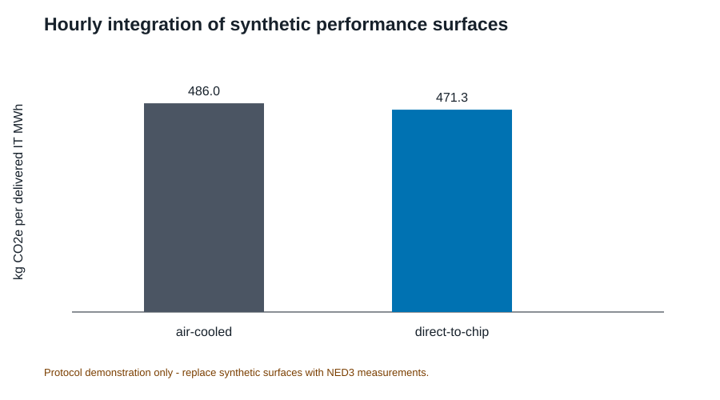

# OpenDC-LCA: an open, evidence-gated framework for reproducible life-cycle and climate-performance analysis of data-center cooling

**Han Hu and Darin W. Nutter**

Department of Mechanical Engineering, University of Arkansas, Fayetteville,
Arkansas, USA

*Draft for coauthor review. Authorship, order, contributions, target journal,
and corresponding-author information must be confirmed before submission.*

## Abstract

The rapid growth and increasing power density of cloud infrastructure have
made cooling architecture a consequential design variable for data-center
energy use, water consumption, material demand, and greenhouse-gas emissions.
Published life-cycle assessments have demonstrated the potential value of cold
plates and one- and two-phase immersion cooling, but independent analysis is
limited by heterogeneous data formats, licensed background inventories,
confidential equipment data, annual-average operating assumptions, and weak
separation between illustrative calculations and evidence suitable for
comparative claims. We present OpenDC-LCA, an open-source Python framework that
connects traceable lifecycle inventories, public grid and climate data, and
laboratory or simulated cooling-performance maps. The framework implements a
common functional unit, explicit system boundaries, annualized and discrete
replacement models, hourly weather-load-performance integration, uncertainty
and sensitivity analysis, and a machine-readable scientific audit that blocks
comparative claims when evidence is synthetic or incomplete. As a validation
case, OpenDC-LCA reconstructed all 24 normalized totals released with a 2025
Microsoft data-center cooling study; the maximum absolute difference between
the reported totals and the sum of their seven released contributions was
1.42 × 10⁻¹⁴ percentage points. For the grid scenario, the released data
corresponded to greenhouse-gas reductions of 15.18%, 16.41%, and 20.66% for
cold-plate, one-phase immersion, and two-phase immersion cooling relative to
air cooling. A second demonstration coupled 8,760 typical-meteorological-year
observations for Fayetteville, Arkansas with explicit, hypothetical
temperature-PUE curves and an EPA eGRID factor. A third demonstration used
complete synthetic load-temperature surfaces to verify bilinear interpolation,
uncertainty propagation, and no-extrapolation safeguards. The latter
demonstrations are intentionally labeled hypothesis-generating or synthetic
and cannot support technology comparisons. OpenDC-LCA therefore contributes
not another generic LCA database, but a transparent and extensible interface
between data-center cooling physics, lifecycle inventories, temporal operation,
and reviewable environmental claims.

**Keywords:** data center; cooling; life-cycle assessment; PUE; immersion
cooling; liquid cooling; reproducibility; open-source software

## 1. Introduction

Data-center thermal management is changing as compute density increases and
operators pursue lower energy and water burdens. Air cooling remains common,
whereas cold plates, single-phase immersion, and two-phase immersion shift heat
removal toward liquid loops and can alter pumps, fans, heat-rejection equipment,
coolants, racks or tanks, building systems, and server configuration. A credible
comparison must therefore extend beyond cooling power alone. It must preserve
equivalent computational service, apply consistent boundaries, include
equipment and fluid lifecycles when they differ, and disclose the conditions
under which the cooling system operates.

Alissa et al. used life-cycle assessment (LCA) to compare data-center cooling
architectures and showed how design choices, electricity supply, equipment,
buildings, servers, and fluids contribute to primary energy, greenhouse-gas
(GHG) emissions, and blue-water consumption [1]. Their publication and released
model archive provide an unusually valuable reference for transparent
data-center cooling research [2]. At the same time, the study illustrates a
broader reproducibility problem. Public source tables allow selected results to
be reconstructed, but complete independent replication still requires
foreground bills of materials, measured operating data, manufacturer
information, and background processes that may be licensed or confidential.

General-purpose LCA software, including openLCA, provides process-network
modeling, impact assessment, and database interoperability [3]. OpenDC-LCA is
not intended to replace these tools. Its role is narrower and complementary:
it defines a domain-specific, inspectable bridge between electronics-cooling
measurements and simulations, data-center operating conditions, lifecycle
inventory factors, and publishable claims. This bridge is important because a
generic LCA model does not by itself determine how a cooling-performance map
should be sampled, how hourly weather and workload should be aligned, when
extrapolation is unacceptable, whether IT service is functionally equivalent,
or whether a result derived from synthetic data can be communicated as a
technology comparison.

The objectives of this work are to:

1. define a transparent data model and calculation boundary for screening the
   lifecycle impacts of data-center cooling architectures;
2. connect laboratory or simulation performance surfaces to hourly climate and
   workload data without hiding interpolation or extrapolation assumptions;
3. preserve source identifiers, versions, units, geography, evidence status,
   and model version in every analysis;
4. reproduce released results from a leading data-center cooling LCA as a
   calculation and lineage check; and
5. prevent numerical completeness from being mistaken for evidentiary
   sufficiency through an automated scientific audit and comparative-claim gate.

## 2. Framework and methods

### 2.1. Software and evidence architecture

Figure 1 summarizes the OpenDC-LCA workflow. Evidence may originate from
published LCA results, public inventories, grid and climate datasets,
laboratory measurements, or simulations. Each source record preserves its
provider, persistent identifier, version, geography, reference year, declared
unit, system boundary, license or redistribution constraint, evidence status,
and local checksum. Harmonization is performed before calculation rather than
after results are generated. Scenario JSON and performance CSV files remain
human-readable and can be processed through the command line, a stable Python
API, or a local graphical interface. All interfaces call the same validated
calculation engine.

The framework is implemented in Python 3.10 or later and distributed under the
MIT License [4]. Version 1.0 exposes validated scenario analysis,
performance-map summarization, scientific audit functions, report generation,
and a local browser-based GUI. The GUI binds to the local host by default and
does not alter the data model or calculation path.

### 2.2. Goal, functional unit, and system boundary

The present functional unit is one MWh of electricity delivered to IT equipment
(`it_mwh`). This denominator is valid only when the alternatives provide
equivalent computational service, utilization, reliability, and hardware life.
If cooling changes compute performance, throttling, server configuration, or
replacement, an IT-energy denominator alone is insufficient and absolute
results plus a service-based unit should be reported.

The default `cooling_system_cradle_to_grave` boundary includes cooling and
heat-rejection equipment, fluids, represented maintenance and replacement,
operation, and end of life. A `facility_cradle_to_grave` option can include
building, electrical, and IT assets. Common systems may be excluded only when
their quantities, performance, lifetime, and end-of-life treatment are
unchanged between alternatives. Location-based and market-based electricity
results are kept separate. On-site water consumption and electricity
supply-chain water are also reported separately.

### 2.3. Static energy and lifecycle calculations

For IT capacity \(P_\mathrm{IT}\), capacity factor \(u\), and study duration of
one year, annual IT electricity is

\[
E_\mathrm{IT}=P_\mathrm{IT}u(8760).
\tag{1}
\]

Annual facility electricity is

\[
E_\mathrm{facility}=E_\mathrm{IT}\,\mathrm{PUE}.
\tag{2}
\]

For an operational impact factor \(EF_k\) for category \(k\), the operational
impact normalized by delivered IT electricity is

\[
I_{k,\mathrm{op}}=EF_k\,\mathrm{PUE}.
\tag{3}
\]

Equipment production and end-of-life burdens may be annualized with a discrete
replacement model:

\[
I_{k,\mathrm{eq}} =
\sum_i
\frac{q_i\left\lceil L_s/L_i\right\rceil
\,\left(I_{k,i}^{\mathrm{prod}}+I_{k,i}^{\mathrm{EOL}}\right)}
{L_s},
\tag{4}
\]

where \(q_i\) is component quantity, \(L_s\) is the study period, and \(L_i\)
is component service life. A linearized option is retained for screening.
Negative end-of-life factors are permitted only for explicitly documented
recovery or substitution credits.

For a cooling fluid with initial mass \(m_0\), facility life \(L_f\), annual
loss \(m_\mathrm{loss}\), production factor \(I_k^\mathrm{fluid}\), and direct
GWP \(GWP_\mathrm{direct}\),

\[
m_\mathrm{prod,annual}=\frac{m_0}{L_f}+m_\mathrm{loss},
\tag{5}
\]

\[
I_{k,\mathrm{fluid}}=m_\mathrm{prod,annual}I_k^\mathrm{fluid},
\qquad
GHG_\mathrm{direct}=m_\mathrm{loss}GWP_\mathrm{direct}.
\tag{6}
\]

### 2.4. Performance-map and temporal integration

Each performance-map row records architecture, test identifier, IT load, heat
removed, coolant temperatures, flow, pressure drop, pump power, fan power, CDU
power, heat-rejection power, on-site water rate, dry- and wet-bulb temperature,
duration, measurement uncertainty, and source identifier. Aggregate metrics are
energy-weighted rather than arithmetic averages of ratios.

The measurement-ready interface uses a complete rectangular surface over IT
load \(P\) and ambient dry-bulb temperature \(T\). For a query point inside one
cell of the measured grid, cooling power is evaluated by bilinear interpolation:

\[
Q_c(P,T) =
(1-\alpha)(1-\beta)Q_{11}
\alpha(1-\beta)Q_{21}
(1-\alpha)\beta Q_{12}
\alpha\beta Q_{22},
\tag{7}
\]

where \(\alpha=(P-P_1)/(P_2-P_1)\) and
\(\beta=(T-T_1)/(T_2-T_1)\). The same operation is applied to on-site water
rate and declared measurement uncertainty. Queries outside the measured
domain are rejected; the software does not silently extrapolate.

For hour \(h\), partial PUE and normalized operational GHG are

\[
\mathrm{PUE}_h=1+\frac{Q_{c,h}}{P_{\mathrm{IT},h}},
\tag{8}
\]

\[
GHG_\mathrm{op}=
\frac{\sum_h E_{\mathrm{IT},h}\mathrm{PUE}_h EF_{\mathrm{grid},h}}
{\sum_h E_{\mathrm{IT},h}}.
\tag{9}
\]

The current public-data demonstration uses an annual location-based EPA eGRID
factor rather than an hourly or marginal factor. Weather observations are from
a NOAA typical meteorological year (TMY) file [5,6].

### 2.5. Uncertainty, sensitivity, and scientific audit

OpenDC-LCA supports seeded Monte Carlo screening with uniform, triangular,
normal, and lognormal distributions for selected continuous parameters.
Independent sampling improves reproducibility but does not represent
correlation, systematic measurement bias, or model-form uncertainty.
One-at-a-time elasticity identifies influential inputs but should not be
interpreted as a global sensitivity analysis.

The audit operates on scientific as well as numerical requirements. It checks
source completeness, duplicate identifiers, physical values, functional unit,
boundary description, evidence status, uncertainty disclosure, and comparative
assertion intent. Synthetic or illustrative data must set the comparative
assertion to false. A public comparative claim additionally requires
decision-grade provenance, consistent boundaries, quantified uncertainty, and
independent critical review consistent with the intent of ISO 14040 and ISO
14044 [7,8]. The automated audit supports review but is not an ISO conformity
assessment.

## 3. Data and evaluation cases

### 3.1. Microsoft/Nature released source data

The validation case used the source data and model archive released with Alissa
et al. [1,2]. The tested claim was limited: for each architecture, electricity
scenario, and impact category, did the released normalized total equal the sum
of the seven released contributions for use phase, building, server, rack or
tank, cable, supporting equipment, and cooling fluid? The audit covered four
architectures, two electricity scenarios, and three metrics, for 24 totals.
It did not independently recreate licensed background inventories,
manufacturer data, confidential bills of materials, measured PUE values, or
the complete virtual-core model.

### 3.2. Public grid and climate data

EPA eGRID 2023 supplied the Arkansas state total-output emission rate
`STC2ERTA`, 452.881 kg CO2e per MWh [5]. This annual factor is location-based
and cannot be interpreted as marginal, hourly, or market-based. NOAA TMY data
for the station nearest Fayetteville supplied 8,760 hourly weather observations
[6]. The hourly preview combined these observations with explicit
piecewise-linear temperature-PUE hypotheses. These curves are not measurements.

### 3.3. Measurement-surface software fixtures

Complete air-cooled and direct-to-chip load-temperature surfaces were generated
as synthetic fixtures to test input validation, bilinear interpolation,
uncertainty bounds, hourly workload-weather alignment, and annual aggregation.
Both datasets carry `evidence_status = synthetic`, and the machine-readable
output sets `comparative_claim_allowed = false`. Their difference is a software
test, not a finding about cooling technologies.

### 3.4. Additional registered evidence

The source registry also documents USLCI v1.2026-06.0, ÖKOBAUDAT 2024-II,
Boavizta ICT factors, seven NREL hydrogen datasets accessed through GLAD and
the Federal LCA Commons, and USGS watershed data [9-13]. These sources establish
future adapters for equipment, building, backup-power, embodied ICT, and water
context. Registration does not make datasets automatically compatible;
geography, reference year, unit, product system, impact method, and allocation
must be harmonized for each study.

## 4. Results

### 4.1. Exact reconstruction of released normalized totals

All 24 Microsoft/Nature released totals were reconstructed by summing the seven
released contribution categories. The maximum absolute disagreement was
1.42 × 10⁻¹⁴ percentage points, consistent with floating-point representation.
Figure 2 summarizes the grid-scenario reductions relative to air cooling.

For primary energy, the released data gave reductions of 14.98%, 15.33%, and
20.05% for cold plate, one-phase immersion, and two-phase immersion,
respectively. Corresponding GHG reductions were 15.18%, 16.41%, and 20.66%.
Blue-water reductions were larger: 30.64%, 44.94%, and 47.88%. Under the
released 100% renewable scenario, the normalized GHG results were substantially
lower for all architectures, while the relative ranking and contribution mix
remained dependent on embodied and non-electricity terms.

### 4.2. Hourly climate-performance preview

The Fayetteville TMY ranged from cool winter conditions to hot summer
conditions, producing distinct monthly means under the assumed
temperature-PUE curves (Figure 3). Annual mean PUE values were 1.0907 for air
cooling, 1.0529 for cold plate, 1.0406 for one-phase immersion, and 1.0352 for
two-phase immersion.

Using the annual Arkansas eGRID factor, the assumed curves produced operational
GHG intensities of 493.97, 476.84, 471.27, and 468.82 kg CO2e per delivered IT
MWh for air, cold-plate, one-phase, and two-phase cooling, respectively
(Figure 4). Relative to the air-cooled hypothesis, the reductions were 3.47%,
4.59%, and 5.09%. These values quantify only the consequences of the stated PUE
hypotheses and must not be interpreted as measured architecture performance.

### 4.3. Measurement-ready surface demonstration

The synthetic surfaces supplied complete combinations of load and ambient
temperature. The engine integrated 8,760 aligned hourly observations without
extrapolation (Figure 5). Both fixtures processed 646,050 kWh of IT electricity.
The air-cooled fixture produced 47,308.5 kWh of cooling electricity,
8,137.8 L of on-site water, mean PUE 1.07323, and 486.04 kg CO2e per IT MWh.
The direct-to-chip fixture produced 26,209.8 kWh of cooling electricity,
2,170.1 L of water, mean PUE 1.04057, and 471.25 kg CO2e per IT MWh. These
numbers verify the computational pathway only.

Declared measurement uncertainty was propagated to cooling power, producing a
PUE interval of 1.06957-1.07689 for the air-cooled fixture and
1.03854-1.04260 for the direct-to-chip fixture. Figure 6 visualizes the
performance-surface contract and its bounded interpolation domain.

### 4.4. Capability and evidence matrix

Table 1 summarizes the implemented functions and the evidence required for
their defensible use. The distinguishing contribution is the continuity from
data registration through physics-informed temporal integration to an explicit
claim gate. Numerical outputs remain available for inspection even when the
audit blocks a comparative conclusion.

**Table 1. OpenDC-LCA capability and evidence matrix.**

| Capability | Input | Method | Output | Evidence requirement | Status |
|---|---|---|---|---|---|
| Source registration | Provider, ID, version, geography, unit, boundary, license | Schema validation and checksum manifest | Traceable record | Complete metadata and redistribution review | Implemented |
| Static lifecycle screening | Energy, PUE, grid factors, equipment, fluids, water | Annual energy balance and lifecycle annualization | Absolute and normalized impacts | Compatible unit and boundary | Implemented |
| Temporal operation | Hourly weather, workload, grid and cooling response | Hourly alignment and integration | PUE, energy, water, operational GHG | Full coverage and accounting basis | Implemented |
| Performance surface | Load-temperature grid, uncertainty, source IDs | Bounded bilinear interpolation | Hourly cooling response | Reviewed measurements; no extrapolation | Implemented |
| Uncertainty and sensitivity | Distributions, seed and perturbations | Monte Carlo and elasticity | Intervals and ranked drivers | Distribution and correlation review | Screening |
| Scientific claim gate | Scenario, sources, evidence status and intent | Automated blockers and warnings | Reviewable findings | Independent critical review for public claims | Implemented |
| Access | JSON or CSV | Shared engine through CLI, API and local GUI | JSON, tables, figures and reports | Same model version across interfaces | Implemented |

## 5. Discussion

### 5.1. Contribution relative to general LCA software

OpenDC-LCA does not compete with openLCA as a process-network editor, database
manager, or life-cycle impact assessment platform. Instead, it supplies
data-center-specific foreground logic and a reproducibility contract. An
openLCA or another LCA tool can generate background factors or complete product
systems; OpenDC-LCA can then preserve the factors' provenance and couple them
to cooling physics, hourly operating conditions, equipment replacement, and
comparative-claim rules. This division allows domain experts to inspect the
assumptions that most directly control cooling comparisons.

The framework's first scientific contribution is an explicit bridge between
measurements and LCA. Cooling studies commonly report COP, pump power,
temperature, flow, pressure drop, or PUE under selected conditions. Lifecycle
studies often require annual energy and water totals. The performance-surface
contract makes that transformation reviewable and rejects operation outside
the tested domain.

The second contribution is evidence-aware computation. The same engine accepts
published, public, experimental, and simulated data, but the audit does not
treat these evidence classes as interchangeable. This is especially important
for software examples: a polished figure generated from synthetic values can
look like a technology benchmark. Machine-readable blocking makes the
limitation part of the result rather than a sentence that can be accidentally
removed.

The third contribution is staged reproducibility. Exact reconstruction of the
released Microsoft/Nature component totals establishes arithmetic and lineage
consistency. It does not imply an independent recreation of proprietary
background datasets. This distinction helps identify the next evidence needed
for a deeper comparison: reviewed foreground bills of materials, measured
cooling surfaces, equipment lifetimes, fluid losses, and background processes
with compatible system models.

### 5.2. Implications for experimental research

The current package identifies a direct contribution pathway for electronics
cooling laboratories. Experiments should span IT load or heat load, ambient or
heat-sink temperature, coolant supply temperature, flow, pressure drop, pump
and fan power, heat-rejection power, on-site water, duration, and measurement
uncertainty. Source identifiers and calibration records should accompany every
row. A complete factorial grid is valuable because it supports bounded
interpolation and exposes unsupported operating regions.

The highest-value next dataset is a reviewed comparison of air, cold-plate,
single-phase immersion, and, where safely feasible, two-phase systems under a
shared heat-load emulator and heat-rejection boundary. The experiment should
separate IT-integral fan power, facility cooling power, and heat-rejection
power; report parasitic power at part load; and quantify uncertainty and
repeatability. These measurements would replace the hypothetical and synthetic
curves used here without changing the analysis interface.

### 5.3. Limitations

The validation result is limited to arithmetic reconstruction of released
normalized source data. The package does not redistribute or independently
recreate licensed ecoinvent or LCA for Experts processes. The hourly preview
uses an annual average eGRID factor and hypothetical PUE curves; it does not
capture hourly grid variation, marginal emissions, humidity-dependent heat
rejection, water scarcity, reliability, server performance, or embodied
effects. TMY data describe a representative climate year rather than a
specific future year or extreme event.

The synthetic surface demonstration applies independent point uncertainty and
does not capture correlated sensor bias, interpolation error, model-form
uncertainty, degradation, or failures. The supported functional unit does not
yet capture useful computation directly. The audit cannot replace expert
critical review, and a model can satisfy automated schema checks while still
using scientifically inappropriate factors. Finally, the present framework is
a foreground and screening tool, not a complete life-cycle inventory database.

### 5.4. Development priorities

Four steps would move OpenDC-LCA from a reproducible research framework toward
decision-grade comparative studies. First, populate reviewed NED3
load-temperature performance surfaces for multiple cooling architectures.
Second, add adapters for USLCI and openLCA exchange formats while retaining
provider licenses and process-system metadata. Third, add time-resolved grid
factors, humidity-sensitive heat rejection, water-scarcity characterization,
and workload-based functional units. Fourth, conduct an independent LCA
critical review, including review of allocation, replacement, uncertainty,
cutoff, and data-quality choices. Dr. Nutter's review should be recorded as an
assessment of the method notes and claim-gate logic rather than a request to
answer isolated questions without context.

## 6. Conclusions

OpenDC-LCA provides a transparent, open-source connection between data-center
cooling physics and lifecycle interpretation. Version 1.0 registers evidence,
validates functional and physical assumptions, calculates static and temporal
impacts, integrates measured load-temperature surfaces, propagates screening
uncertainty, and emits machine-readable audit findings through a command line,
Python API, and local GUI. The package exactly reconstructed all 24 released
normalized totals tested from the Microsoft/Nature study, with a maximum
absolute numerical difference of 1.42 × 10⁻¹⁴ percentage points. Its climate
and measurement-surface demonstrations show how public data and laboratory
measurements can be connected to annual environmental indicators, while their
evidence labels prevent synthetic values from becoming technology claims.

The central contribution is thus methodological: transparent calculations are
paired with explicit evidence requirements. The framework is ready for
community use as a screening, teaching, reproducibility, and experimental
design tool. Decision-grade cooling comparisons now require reviewed
performance surfaces and compatible lifecycle inventories, not additional
software architecture.

## Data and code availability

OpenDC-LCA version 1.0 source code, examples, documentation, tests, and derived
paper tables and figures are available at
https://github.com/UARK-NED3/OpenDC-LCA. Provider-native raw files remain local
when redistribution permission has not been established. Released
Microsoft/Nature model files are available from Zenodo [2]. EPA eGRID and NOAA
TMY data are available from their respective public portals [5,6].

## Author contributions

**Draft taxonomy for confirmation:** Han Hu: conceptualization, methodology,
software supervision, thermal-management domain analysis, writing, and
visualization. Darin W. Nutter: LCA methodology review, validation, critical
review, and manuscript revision. Contributions must be confirmed before
submission.

## Competing interests

The authors must complete and approve the journal-specific competing-interest
statement before submission.

## Acknowledgments

Funding, facility, student-contributor, and data-provider acknowledgments must
be confirmed before submission.

## References

1. Alissa, H. et al. Using life cycle assessment to drive innovation for
   sustainable cool clouds. *Nature* **641**, 331-338 (2025).
   https://doi.org/10.1038/s41586-025-08832-3
2. Alissa, H. et al. Data and model archive for “Using life cycle assessment
   to drive innovation for sustainable cool clouds.” Zenodo record 14268168
   (2024). https://doi.org/10.5281/zenodo.14268168
3. GreenDelta. openLCA: open source life cycle assessment software.
   https://www.openlca.org/
4. UARK-NED3. OpenDC-LCA version 1.0.0.
   https://github.com/UARK-NED3/OpenDC-LCA
5. U.S. Environmental Protection Agency. Emissions & Generation Resource
   Integrated Database (eGRID), 2023 detailed data.
   https://www.epa.gov/egrid/detailed-data
6. National Centers for Environmental Information. Typical Meteorological
   Year data. https://www.ncei.noaa.gov/access/typical-meteorological-year/
7. International Organization for Standardization. ISO 14040:2006,
   Environmental management - Life cycle assessment - Principles and
   framework.
8. International Organization for Standardization. ISO 14044:2006,
   Environmental management - Life cycle assessment - Requirements and
   guidelines.
9. National Renewable Energy Laboratory. U.S. Life Cycle Inventory Database,
   version 1.2026-06.0. Federal LCA Commons.
   https://www.lcacommons.gov/
10. Bundesinstitut für Bau-, Stadt- und Raumforschung. ÖKOBAUDAT 2024-II.
    https://www.oekobaudat.de/
11. Boavizta. BoaviztAPI data repository.
    https://github.com/Boavizta/boaviztapi
12. United Nations Environment Programme. Global LCA Data Access network.
    https://www.globallcadataaccess.org/
13. U.S. Geological Survey. Watershed Boundary Dataset.
    https://www.usgs.gov/national-hydrography/watershed-boundary-dataset
