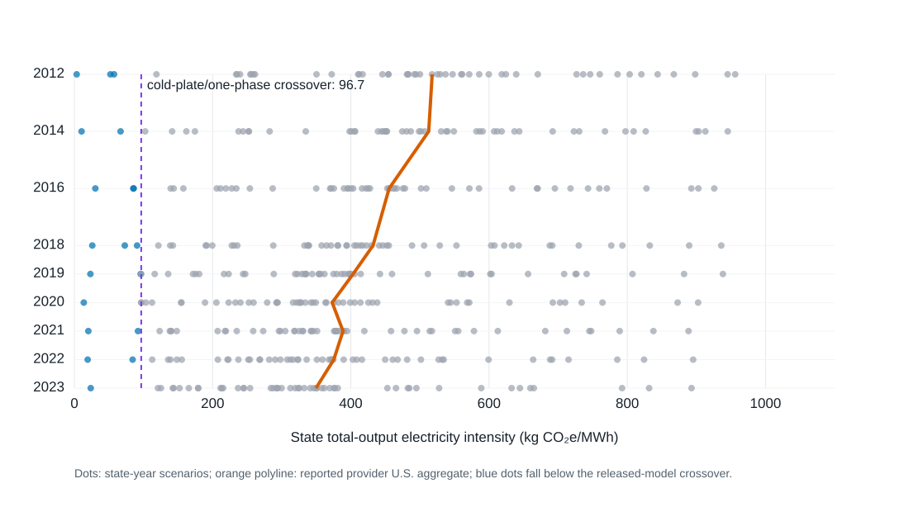

# Consolidated v0.4-v0.5 results package

## Applied Energy extension: grid transition and ranking robustness

The expanded analysis uses EPA eGRID releases for 2012, 2014, 2016, and
2018–2023. The resulting panel contains 459 state-year observations. The
generation-weighted U.S. total-output factor declined from 518.0 to 348.2 kg
CO2e/MWh between 2012 and 2023. Holding the released Microsoft/WSP foreground
model fixed, the modeled two-phase-versus-air benefit declined from 7.49 to
5.26 kg CO2e per Vcore-year as the grid cleaned.

Two-phase immersion remained the lowest modeled GHG architecture in all 459
state-year cases and when server-related contributions were scaled from 0.38
to 2.06 times the Boavizta median scenario. The closer cold-plate/one-phase
comparison was sensitive: across 2023 state factors, a median 1.38% reduction
in the cold-plate use-phase term would reverse the ordering. Two-phase could
tolerate a median 6.46% use-phase increase before losing first rank.

These results are screening re-bases between released endpoints. They identify
the measurement resolution required to test rankings; they do not replace
architecture-specific field performance or a state-specific process LCA.

## Scope and evidentiary status

This package contains two deliberately separated contributions:

1. **v0.4 reproduction audit (validated):** an independent calculation from
   the released Microsoft/Nature Figure 4 source data.
2. **v0.5 hourly research preview (hypothesis-generating):** NOAA TMY weather,
   EPA eGRID 2023, and transparent temperature-PUE curves. The curves are not
   measurements and cannot support comparative environmental claims.

## Reproduction result

All 24 Figure 4 totals (three impact metrics, two electricity scenarios, and
four cooling architectures) were reconstructed by summing the seven released
component contributions. The maximum absolute disagreement was
**1.42e-14 percentage points**, attributable to floating-point rounding.

For the grid scenario, the reproduced GHG reductions relative to air cooling
are **15.18%** for cold plate,
**16.41%** for one-phase immersion, and
**20.66%** for two-phase immersion.

This validates arithmetic consistency of the public component table. It does
not independently reproduce proprietary LCA for Experts or ecoinvent
background processes, confidential manufacturer data, or the Microsoft
foreground bill of materials.

## Hourly research preview

The Fayetteville TMY was evaluated hour by hour using explicit piecewise-linear
PUE hypotheses. With the EPA eGRID 2023 Arkansas factor of
**452.881 kg CO2e/MWh**, the assumed curves produce
operational-only reductions of **3.47%**,
**4.59%**, and
**5.09%** relative to the air-cooled curve.

These percentages are **not findings about the technologies**. They quantify
the implications of stated PUE hypotheses and define the exact laboratory
measurements needed to replace them.

## Equations

For hour h, technology j, and dry-bulb temperature T_h:

`PUE[j,h] = PUE_base[j] + a_hot[j] max(T_h-T_hot[j],0)
                         + a_cold[j] max(T_cold[j]-T_h,0)`

`GHG_operational[j] = sum_h(E_IT,h × PUE[j,h] × EF_grid) / sum_h(E_IT,h)`

The current preview assumes constant hourly IT energy, an annual location-based
grid factor, and no humidity, load, water, reliability, or embodied-impact
coupling.

## Paper-use guidance

- Figure 1 and Tables 1-2 are reproducibility results.
- Figures 2-3 and Tables 3-4 are a research protocol demonstration only.
- Replace the assumed PUE parameters with measured performance maps before
  submitting comparative conclusions.
- Retain the source and limitation statements in any derivative manuscript.

## Sources

- Alissa et al., “Using life cycle assessment to drive innovation for
  sustainable cool clouds,” *Nature* 641, 331-338 (2025),
  https://doi.org/10.1038/s41586-025-08832-3
- Released model archive: https://doi.org/10.5281/zenodo.14268168
- EPA eGRID detailed data: https://www.epa.gov/egrid/detailed-data
- NOAA Typical Meteorological Year:
  https://www.ncei.noaa.gov/access/typical-meteorological-year/

## v0.6 measurement-ready extension

Version 0.6 replaces the fixed temperature-PUE function interface with a
complete measured load-by-temperature surface. It uses bilinear interpolation
inside the measured grid, rejects extrapolation, aligns weather and workload
hourly, and reports a screening interval based on declared measurement
uncertainty.

The included air-cooled and direct-to-chip surfaces are synthetic software
fixtures. Their numerical difference is not a technology result, and the
machine-readable output sets `comparative_claim_allowed` to `false`.

Table 5 records the complete annual integration. The next manuscript-quality
analysis should use the same interface with calibrated NED³ measurements and
`reviewed` evidence status.
