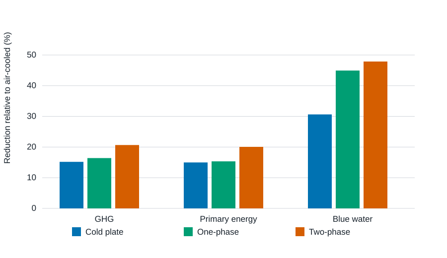
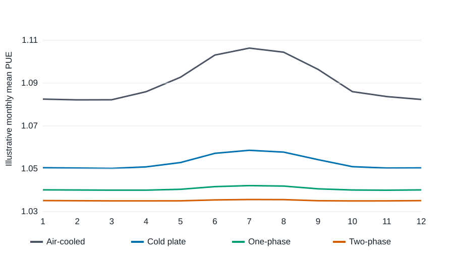
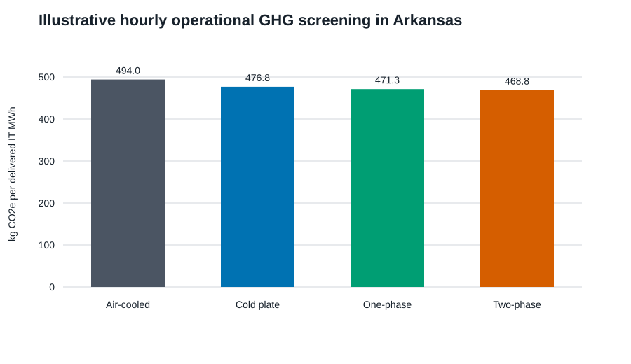

# Consolidated v0.4-v0.5 results package

## Scope and evidentiary status

This package contains two deliberately separated contributions:

1. **v0.4 reproduction audit (validated):** an independent calculation from
   the released Microsoft/Nature Figure 4 source data.
2. **v0.5 hourly research preview (hypothesis-generating):** NOAA TMY weather,
   EPA eGRID 2023, and transparent temperature-PUE curves. The curves are not
   measurements and cannot support comparative environmental claims.

## Reproduction result

All 24 Figure 4 totals (three impact metrics, two electricity scenarios, and
four cooling architectures) were reconstructed by summing the seven released
component contributions. The maximum absolute disagreement was
**1.42e-14 percentage points**, attributable to floating-point rounding.

For the grid scenario, the reproduced GHG reductions relative to air cooling
are **15.18%** for cold plate,
**16.41%** for one-phase immersion, and
**20.66%** for two-phase immersion.

This audits arithmetic consistency of the public component table. It does
not independently reproduce proprietary LCA for Experts or ecoinvent
background processes, confidential manufacturer data, or the Microsoft
foreground bill of materials.

## Hourly research preview

The Fayetteville TMY was evaluated hour by hour using explicit piecewise-linear
PUE hypotheses. With the EPA eGRID 2023 Arkansas factor of
**452.881 kg CO2e/MWh**, the assumed curves produce
operational-only reductions of **3.47%**,
**4.59%**, and
**5.09%** relative to the air-cooled curve.

These percentages are **not findings about the technologies**. They quantify
the implications of stated PUE hypotheses and define the exact laboratory
measurements needed to replace them.

## Equations

For hour h, technology j, and dry-bulb temperature T_h:

`PUE[j,h] = PUE_base[j] + a_hot[j] max(T_h-T_hot[j],0)
                         + a_cold[j] max(T_cold[j]-T_h,0)`

`GHG_operational[j] = sum_h(E_IT,h × PUE[j,h] × EF_grid) / sum_h(E_IT,h)`

The current preview assumes constant hourly IT energy, an annual location-based
grid factor, and no humidity, load, water, reliability, or embodied-impact
coupling.

## Paper-use guidance

- Figure 1 and Tables 1-2 are reproducibility results.
- Figures 2-3 and Tables 3-4 are a research protocol demonstration only.
- Replace the assumed PUE parameters with measured performance maps before
  submitting comparative conclusions.
- Retain the source and limitation statements in any derivative manuscript.

## Sources

- Alissa et al., “Using life cycle assessment to drive innovation for
  sustainable cool clouds,” *Nature* 641, 331-338 (2025),
  https://doi.org/10.1038/s41586-025-08832-3
- Released model archive: https://doi.org/10.5281/zenodo.14268168
- EPA eGRID detailed data: https://www.epa.gov/egrid/detailed-data
- NOAA Typical Meteorological Year:
  https://www.ncei.noaa.gov/access/typical-meteorological-year/
