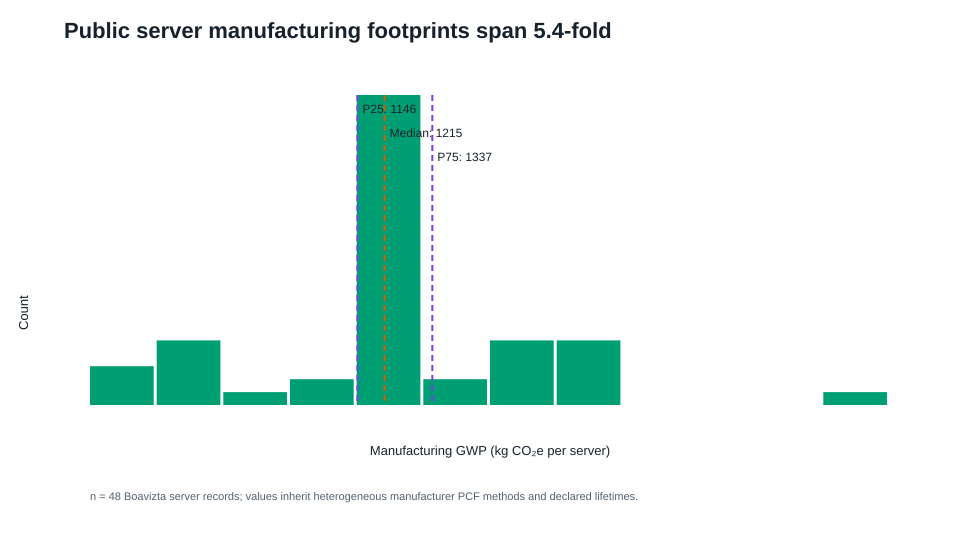
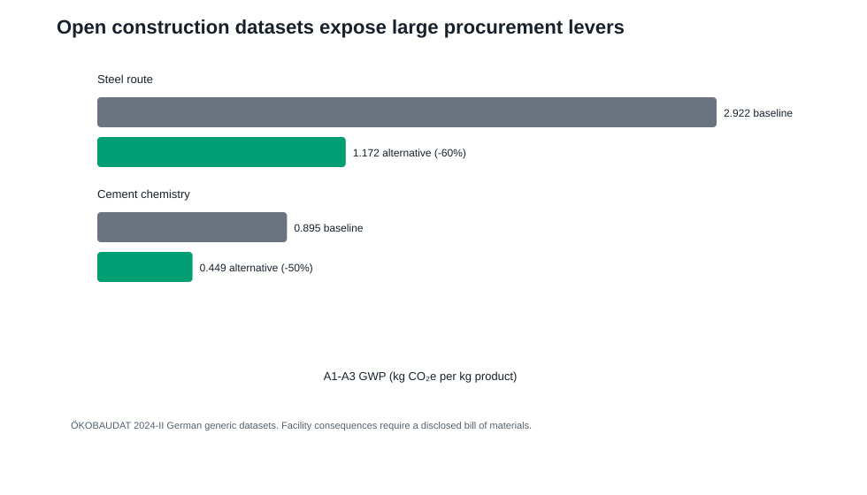

# Supplementary information for the OpenDC-LCA transferability audit

This supplement documents secondary analyses, software fixtures, and
reproducibility details. It must be interpreted with the evidence classes and
claim limits in the main manuscript.

## S1. Evidence inventory and provenance

The source registry records each provider-native file, version, access URL,
declared license or redistribution constraint, local filename, and SHA-256
checksum. Files with uncertain redistribution rights remain under
`private-data/` and are excluded from Git. Derived tables are written to both
`paper/tables/` and a results directory.

The checksum ledger contains 42 provider files, including all nine historical
eGRID downloads. The Applied Energy execution metadata records the files that
enter its numerical results, all directly imported analysis modules, the
Python runtime, Git commit and dirty-state digest, fixed seeds and iterations,
and hashes for every generated table and figure. A provider catalog is not
treated as an execution manifest.

The analyses use specific fields from each provider. First, the Microsoft/WSP
archive supplies normalized GHG, primary-energy, and blue-water contribution
tables, detailed GaBi electricity endpoints, and a pedigree assessment.
Second, eGRID supplies state and U.S. generation, CO2, CH4, N2O, and reported
CO2e rates. Third, the Federal LCA Commons supplies openLCA process exchanges,
product-system links, unit groups, and IPCC AR5-100 characterization factors.
Fourth, Boavizta supplies product category, manufacturer, product name, report
date, lifetime, total GWP, and manufacturing share. Finally, ÖKOBAUDAT supplies
the UUID, product, geography, declared unit, modules A1-A3, GWP, nonrenewable
primary energy, and freshwater.

USLCI, GLAD hydrogen, and USGS records are registered and exchange-tested but
do not enter a reported cooling LCIA total.

## S2. Reproducibility table map

| File | Content | Evidence interpretation |
|---|---|---|
| `table1_microsoft_reproduction_audit.csv` | 24 released totals and reconstruction error | Arithmetic consistency only |
| `table2_grid_reductions_vs_air.csv` | Relative reductions from the released model | Reconstructed released result |
| `table6_state_rebased_ghg.csv` | 2023 state screening outputs | Boundary-mismatched numerical transfer |
| `table8_crossover_thresholds.csv` | Pairwise crossover values | Conditional numerical landmarks |
| `table9_boavizta_server_records.csv` | 48 included public product records | Heterogeneous secondary evidence |
| `table14_egrid_historical_state_factors.csv` | 459 harmonized state-year rates | Direct generation-rate scenarios |
| `table15_egrid_historical_national_factors.csv` | Harmonized and provider U.S. series | Historical trend and scope audit |
| `table21_anchor_extrapolation_diagnostic.csv` | Within/below/above anchor counts | Transformation-validity diagnostic |
| `table22_boundary_mismatch_stress.csv` | Additive allowance cases | Sensitivity, not an upstream estimate |
| `table23_joint_assumption_stress.csv` | Seeded stress frequencies | Not probability or confidence |
| `table24_functional_unit_sensitivity.csv` | Impact-per-service break-even correction | Measurement-resolution target |
| `table25_priority_index_sensitivity.csv` | Rank stability across index weights | Heuristic diagnostic |
| `table26_stress_structure_sensitivity.csv` | Assumption-block and dependence designs | Design sensitivity, not empirical probability |
| `table28_lifecycle_electricity_factors.csv` | 71 ordinary at-user consumption systems | Partial provider-linked LCI with documented cutoffs |
| `table29_standardized_rank_robustness.csv` | Exact equal-width reversal bounds | Deterministic uncertainty sets |
| `table30_released_endpoint_method_audit.csv` | Article/workbook method conflict | Blocks a common-method cooling claim |
| `table31_implied_electricity_response.csv` | Slopes implied by released endpoints | Diagnostic response, not measured demand |
| `table32_national_lifecycle_cutoffs.csv` | National unlinked inputs | Omitted-upstream audit |
| `table33_residual_electricity_factors.csv` | Separate residual-consumption systems | Market-based accounting sensitivity |
| `table34_boavizta_server_inclusion.csv` | All 55 candidates and reasons | Transparent inclusion/exclusion flow |

## S3. Released lifecycle results

The 24-cell reconstruction includes GHG, primary energy, and blue water. The
main manuscript focuses on GHG because the historical eGRID extension supplies
gas-specific air-emission data, not lifecycle primary-energy or
electricity-mediated water inventories. The other indicators inherit the
released functional unit, boundary, allocation, performance, and electricity
cases and were not re-based with eGRID.

## S4. Endpoint and crossover diagnostics

The article identifies AR5 GWP100, but the detailed public workbook contains
the two numeric electricity endpoints in cells labelled GTP100, while its
corresponding GWP100 cells are blank. Direct worksheet-XML parsing verifies
that comparative use-phase formulas `Comparative results 0% RE!D118` and
`Comparative results 100% RE!D122` point to those blank F29 cells. This unresolved method
identity prevents treatment of the cooling screen as a common-method LCA.

Supplementary Figure S1 plots the affine GHG screening lines for air cooling,
cold plate, single-phase immersion, and two-phase immersion against 2023
state/DC total-output electricity intensity. The two vertical markers locate
the 96.704 kg CO2e/MWh cold-plate/single-phase crossover and the weighted
50-state-plus-DC reference factor.


The two-phase numerical line has no crossover with cold plate or single-phase
inside the 2023 state-rate range under the fixed released foreground. This is
conditional on server performance, fluid, equipment quantity, lifetime, and
the numerical transfer model.

## S5. Electricity-system calculation

The 2023 ordinary consumption systems comprise 60 balancing authorities, 10
FERC regions, and the national system. The national partial linked-system
result is 422.931 kg CO2e/MWh, with 369.848 from named generation processes and
53.084 from other linked processes. The matched residual-consumption result is
455.350 kg CO2e/MWh and is kept separate.

The national ordinary system solves 582 processes and 1,174 provider links in
five fixed-point iterations. It retains 287 unlinked technosphere inputs
across 47 processes as explicit cutoffs. Provider scope also omits
transmission/distribution infrastructure and some generation infrastructure.
The results are partial-scope screening factors, not complete electricity
lifecycle benchmarks. The custom solver has an analytic unit-conversion,
provider-scaling, elementary-flow-sign, and cutoff test, but independent
reproduction in openLCA or Brightway remains a submission action.

## S6. Robustness analyses

Supplementary Figure S2 plots two break-even use-phase adjustments against
2023 state electricity intensity. The blue curve gives the cold-plate change
required to equal single-phase immersion, while the orange curve gives the
two-phase degradation that can occur before another architecture becomes the
numerical first rank.


At equal relative half-widths, the national first-rank screen reverses at
2.99% for technology-specific use phase, 22.15% for embodied burden, 2.64% for
service equivalence, and 1.32% when all four blocks vary. The shared grid-only
set does not reverse the order through 99.999%. These are exact set-based
certificates around the numerical screen, not physical validation.

The earlier triangular design assigned embodied burden a half-width ten times
the use-phase and service widths. Within that declared wide design,
embodied-only variation gave a 63.36% two-phase first-rank frequency, compared
with 79.52% for use only, 73.90% for service only, and 100% for grid only. The
frequencies describe that stress design, not empirical uncertainty.
`table27_stress_convergence.csv` records nested 5,000-, 20,000-, and
80,000-draw checks and numerical Monte Carlo standard errors.

## S7. Server-product evidence

Supplementary Figure S3 presents the manufacturing-GHG distribution for the 48
included Boavizta server records and marks the 25th percentile, median, and 75th
percentile at 1,146, 1,215, and 1,337 kg CO2e/server, respectively.



Table 34 provides a candidate-level inclusion audit for all 55
`Datacenter/Server` records by retaining the product identity, total GWP,
manufacturing share, lifetime, inclusion status, and exclusion reason.
Forty-eight records contain total GWP, manufacturing share, and positive
lifetime, while seven Lenovo records are excluded because manufacturing share
is blank. The common-scaling stress uses included annualized dispersion but is
not a product-substitution model. Decision use requires architecture-specific
server count, configuration, useful computation, and lifetime under harmonized
product rules.

## S8. Construction-material screening

Supplementary Figure S4 compares matched German generic A1-A3 GHG factors for
two procurement choices. The selected high-scrap electric-arc-furnace steel
route decreases the factor from 2.922 to 1.172 kg CO2e/kg product, while the
selected CEM III cement chemistry decreases it from 0.895 to 0.449 kg
CO2e/kg product.



The selected records are German generic datasets. A facility analysis requires
architecture-specific quantities, material grade and supplier, fabrication,
transport, replacement, and end-of-life alignment.

## S9. Climate and performance-map fixtures

The Fayetteville TMY file contains 8,760 hourly weather records. It is paired
with a synthetic performance surface to test schema and unit validation,
bounded bilinear interpolation, uncovered-domain rejection, cooling-only
partial-PUE integration with one constant grid factor, and interface
consistency.

Supplementary Figures S5 and S6 document the two views of this software
fixture. Figure S5 integrates the synthetic performance map over 8,760 hourly
weather records to compare monthly cooling-only partial PUE for four
architectures, while Figure S6 resolves the input surface across dry-bulb
temperatures from -15 to 35 °C and IT loads of 40, 70, and 100 kW.


Wet-bulb temperature is validated in the input schema but is not an
interpolation coordinate. Other facility overhead is outside the partial-PUE
boundary unless included in the supplied cooling-power field. Submission-grade
results require architecture-specific measured power for IT-integral fans,
pumps, coolant distribution, heat rejection, controls, and onsite water over a
common load-weather domain, plus an energy-balance residual.

## S10. Data-priority diagnostic

The base index multiplies mean released GHG contribution by normalized pedigree
weakness. Alternative exponents show that use phase is usually, but not always,
first. Storage remains in the top tier. This is not formal value of information.
Formal analysis would require empirical distributions and correlations, the
probability and consequence of a wrong choice, measurement cost and precision,
a decision threshold, stakeholder utility, and posterior updating.

## S11. Reliability and interoperability

The package supports discrete replacement, linearized replacement, Weibull
renewal expectation, and optional Arrhenius acceleration. These functions do
not supply architecture-specific reliability without failure, maintenance,
duty-cycle, temperature, censoring, and downtime records. Dependent failures,
redundancy, and repair queues require an extended model.

Successful openLCA JSON-LD parsing or Brightway mapping establishes syntactic
exchange only. Numerical compatibility also requires matching reference
product and unit, provider and database version, geography and year, system
model, allocation, cutoff, elementary-flow nomenclature, LCIA method, and
foreground linkage. USLCI and GLAD archives remain future inputs rather than
silent substitutes in the current cooling results.

## S12. Software claim controls

Scenario parsing rejects non-finite numeric values. Result manifests retain
the field-to-source map and stable digests of source records. Public comparison
requests are blocked when functional units, boundaries, electricity
accounting, allocation, LCIA methods, or replacement rules differ, or when
field-level lineage is missing. A custom comparative boundary requires a
structured inclusion/exclusion record that must match across scenarios.

These are metadata blockers, not authentication, parameter-level uncertainty
mapping, ISO conformity, or evidence that an external review occurred. Useful
computation remains a manual prerequisite because the executable functional
unit is presently `it_mwh`.

## S13. Reproduction commands

Run the following commands from the repository root.

```bash
python -m pip install -e .
python scripts/run_submission_pipeline.py --skip-refresh
```

Omit `--skip-refresh` to start from provider downloads. Use
`--skip-documents` when document-conversion dependencies are unavailable. The
pipeline runs source-manifest creation, research, integrated-evidence, and
Applied Energy analyses in order, followed by tests and document builds.

A clone without `private-data/` runs the public package tests and explicitly
skips the paper-reconstruction tests. Rebuilding the paper requires locally
held provider files whose hashes appear in the manifest. Archive the source
manifest, execution metadata, derived tables, exact Git commit, compiled main
text, and supplement together.
