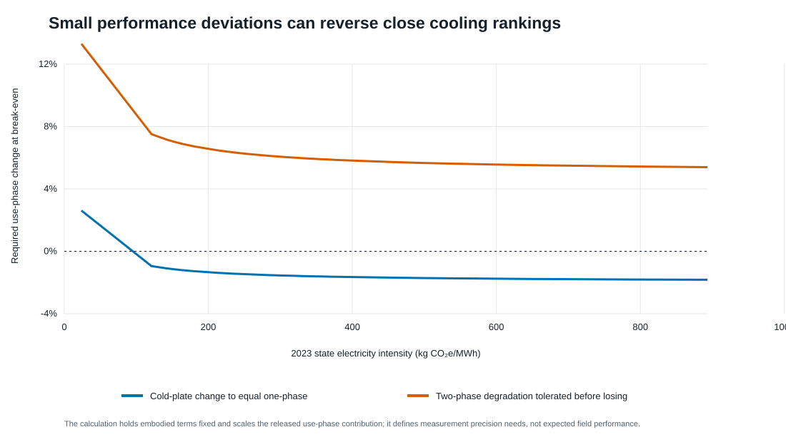
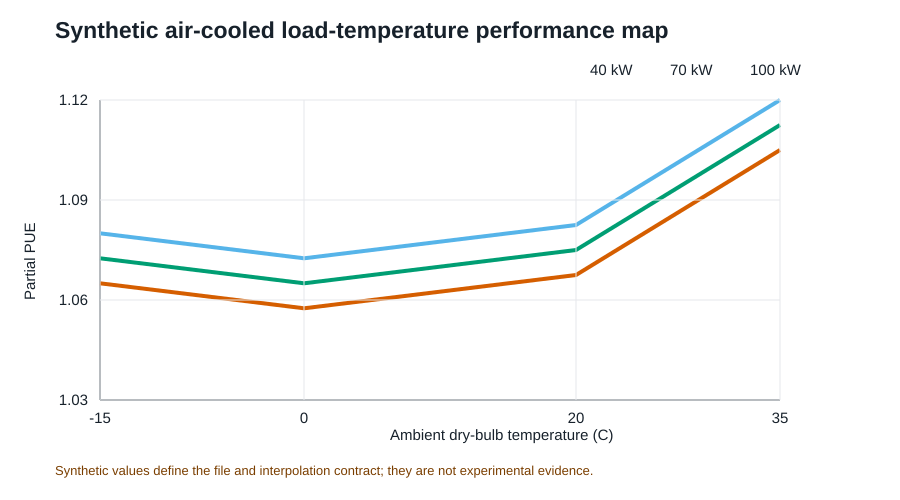

# Supplementary information for OpenDC-LCA

This supplement documents secondary analyses, illustrative software cases,
and reproducibility details that are useful for audit but not necessary to the
main argument. It must be read with the evidence classifications in the
manuscript.

## S1. Evidence inventory and provenance

The repository source registry records each provider-native file, version,
access URL, declared license or redistribution constraint, local filename, and
SHA-256 checksum. Raw files with uncertain redistribution rights remain under
`private-data/` and are excluded from Git. Derived, non-provider tables are
written to both `paper/tables/` and a results directory.

The checksum ledger contains 40 provider files in 10 source groups, including
all nine historical eGRID downloads. The applied-energy metadata separately
records the 11 files that enter its numerical results, their byte counts and
SHA-256 hashes, the analysis-script hash, the base seed, and iterations per
design. This narrower execution manifest prevents a complete download catalog
from being mistaken for the actual computational dependency set.

The manuscript analysis uses the following provider fields:

- Microsoft/WSP: normalized GHG, primary-energy, and blue-water contribution
  tables; detailed GaBi electricity endpoints; pedigree assessment.
- eGRID: `STNGENAN`, `STCO2AN`, `STCH4AN`, `STN2OAN`, and `STC2ERTA` at the
  state level and corresponding `US*` fields at the U.S. level.
- Boavizta: product category, manufacturer, product name, report date,
  lifetime, total GWP, and manufacturing share.
- ÖKOBAUDAT: UUID, product, geography, declared unit, modules A1-A3, GWP,
  nonrenewable primary energy, and freshwater.

USLCI, GLAD hydrogen, and USGS records are registered and exchange-tested but
do not enter a reported LCIA total.

## S2. Reproducibility table map

| File | Content | Evidence interpretation |
|---|---|---|
| `table1_microsoft_reproduction_audit.csv` | 24 released totals and reconstruction error | Arithmetic consistency only |
| `table2_grid_reductions_vs_air.csv` | Relative reductions from the released model | Reconstructed released result |
| `table6_state_rebased_ghg.csv` | 2023 state screening outputs | Boundary-mismatched screening transformation |
| `table8_crossover_thresholds.csv` | Pairwise crossover values | Conditional on a numerical transfer between the two released electricity endpoints |
| `table9_boavizta_server_records.csv` | 48 public product records | Heterogeneous secondary evidence |
| `table11_material_decarbonization_levers.csv` | Selected matched process comparisons | Per-unit procurement leverage only |
| `table14_egrid_historical_state_factors.csv` | 459 harmonized state-year rates | Direct generation-rate scenarios |
| `table15_egrid_historical_national_factors.csv` | Harmonized and provider U.S. series | Historical trend and scope audit |
| `table21_anchor_extrapolation_diagnostic.csv` | Within/below/above anchor counts | Transformation-validity diagnostic |
| `table22_boundary_mismatch_stress.csv` | Additive allowance cases | Sensitivity, not an upstream estimate |
| `table23_joint_assumption_stress.csv` | Seeded stress frequencies | Not probability or confidence |
| `table24_functional_unit_sensitivity.csv` | Impact-per-service break-even correction | Measurement-resolution target |
| `table25_priority_index_sensitivity.csv` | Rank stability across index weights | Heuristic diagnostic |
| `table26_stress_structure_sensitivity.csv` | Assumption-block and dependence designs | Triangular-marginal sensitivity; not empirical probability |

## S3. Released primary-energy and blue-water results

The 24-cell reconstruction includes GHG, primary energy, and blue water. The
main manuscript focuses on GHG because the historical eGRID extension supplies
gas-specific air-emission data, not a lifecycle primary-energy or
electricity-mediated water inventory.

At the released U.S. grid endpoint, the Microsoft/WSP normalized results show
that cold plate, single-phase immersion, and two-phase immersion reduce the
three indicators relative to air cooling. These results inherit the released
functional unit, boundaries, inventories, allocation, performance, and
electricity cases. They were not re-based with eGRID for primary energy or
water.

## S4. Pairwise crossover screen


The two-phase architecture has no crossover with cold plate or single-phase
inside the 2023 state-rate range under the fixed released foreground. This
absence is conditional on server performance, fluid, equipment quantity,
lifetime, and the electricity transfer model.

## S5. Deterministic performance discrimination



The cold-plate/single-phase order can be reversed by small use-phase changes.
The two-phase margin is larger in the one-at-a-time test but becomes less
decisive under joint stress, as reported in the main manuscript.

## S6. Boavizta server-product dispersion


The common-scaling stress applies the empirical annualized dispersion to the
released compute, storage, and networking contributions simultaneously. It is
not a product substitution model. Decision-grade use requires
architecture-specific server count, configuration, useful computation, and
lifetime under harmonized product-carbon-footprint rules.

## S7. ÖKOBAUDAT material-route screen


The selected records are German generic datasets. A facility-level analysis
requires architecture-specific quantities, material grade and supplier,
fabrication, transport, replacement, and end-of-life alignment.

## S8. Hourly climate and performance-map examples

The Fayetteville TMY file contains 8,760 hourly weather records. The repository
uses it with a synthetic cooling-performance surface to test:

1. schema and unit validation;
2. bounded bilinear interpolation;
3. uncovered-domain rejection;
4. hourly PUE and operational-impact integration; and
5. CLI, API, GUI, and report consistency.




Submission-grade energy results require architecture-specific measured power
for IT-integral fans, pumps, coolant distribution, heat rejection, controls,
and onsite water over a common load-weather domain.

## S9. Data-quality priority and its limitations

The base priority index multiplies mean released GHG contribution by normalized
pedigree weakness. Alternative exponents show that use phase is usually, but
not invariably, first. Storage remains consistently in the top tier. This
robustness test prevents the heuristic index from being described as a formal
value-of-information result.

Formal value of information would additionally require:

- empirically defensible parameter distributions and correlations;
- the probability and consequence of selecting the wrong architecture;
- cost, duration, and achievable precision of each measurement or inventory;
- a decision threshold and stakeholder utility; and
- posterior updating after data acquisition.

The main-text block decomposition complements this heuristic. Under the
declared U.S. wide envelope, embodied-only variation reduced the two-phase
first-rank frequency to 63.36%, compared with 79.52% for use only, 73.90% for
service only, and 100% for grid only. These frequencies rank leverage only
within the declared stress widths; they do not estimate empirical variance.

`table27_stress_convergence.csv` records nested 5,000-, 20,000-, and
80,000-draw runs. For the U.S. narrow, screening, and wide envelopes, the
20,000-draw estimates differed from the 80,000-draw estimates by 0.058, 0.056,
and 0.110 percentage points, respectively. The largest difference across both
locations was 0.709 percentage points. The table reports numerical Monte Carlo
standard errors but does not interpret them as empirical uncertainty.

## S10. Reliability and replacement

The package supports discrete replacement, linearized replacement, Weibull
renewal expectation, and optional Arrhenius acceleration. These functions are
tested independently of the Microsoft/WSP secondary analysis. They do not
provide architecture-specific reliability without failure and maintenance
data.

Required records include component definition, population, duty cycle,
temperature history, failure mode, censoring, repair/replacement action,
downtime, spare inventory, fluid loss, and calibration/inspection history.
Dependent failures, redundancy, and repair queues require an extended model.

## S11. Interoperability boundary

Successful openLCA JSON-LD parsing or Brightway mapping establishes syntactic
exchange. Numerical compatibility additionally requires matching:

- reference product and unit;
- provider and database version;
- geography and reference year;
- attributional or consequential system model;
- allocation and cut-off;
- elementary-flow nomenclature;
- LCIA method and version; and
- foreground product-system linkage.

The seven GLAD hydrogen archives and USLCI database are therefore preserved as
future inputs, not silently substituted into the current cooling results.

## S12. Reproduction commands

From the repository root:

```bash
python -m pip install -e .
python scripts/build_source_manifest.py --check
python scripts/run_integrated_evidence_analysis.py
python scripts/run_applied_energy_analysis.py
python -m unittest discover -s tests -v
python paper/build_manuscript.py
python paper/build_overleaf.py
```

The scripts use fixed output paths, newline-stable CSV writing, and stable
scenario-specific seeds. A clone without `private-data/` runs the public
package tests and explicitly skips eight paper-reconstruction tests. Rebuilding
the paper requires the locally held provider files whose hashes appear in the
manifest. The manifest, derived tables, analysis metadata, and exact Git commit
should be archived together for submission.
