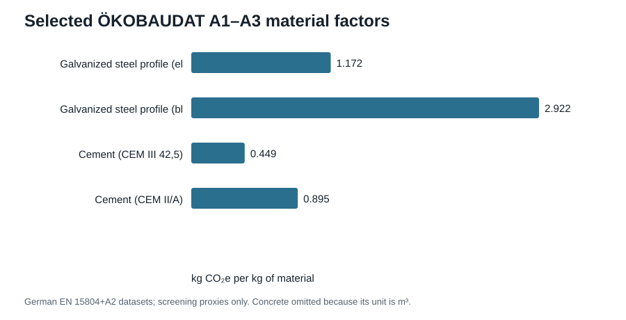

# Public-data screening results

This run demonstrates that OpenDC-LCA can ingest provider-native public data
without committing the large raw databases. It is **not** a comparative
cooling-technology LCA.

## Equations and results

The location-based operational calculation is

`GHG_operational = EF_grid × PUE`,

where `EF_grid` is EPA eGRID field `STC2ERTA`. For Arkansas, the 2023 factor is
**452.881 kg CO2e/MWh**. The evaluated PUE range produces
**498.2–634.0 kg CO2e per delivered IT MWh**.

The Fayetteville TMY contains **8,760 hours** with mean dry-bulb
temperature **14.86 °C**, a range of
**-13.0 to 35.0 °C**,
and **319 hours above 30 °C. These values establish
local climate context; a later release will couple hourly weather to measured
cooling performance.

## Interpretation limits

- ÖKOBAUDAT values are A1–A3 German construction-product proxies and are not a
  replacement for a US data-center bill of materials.
- The seven GLAD/NREL hydrogen packages are preserved in the catalog for future
  hydrogen/backup-power scenarios; they do not affect this result.
- USLCI, Microsoft/Nature, Boavizta, USGS, and other acquired files are
  catalogued inputs for later adapters and validation.
- See [`data/SOURCES.md`](../../data/SOURCES.md) for citations, rights, hashes,
  and exact source roles.
